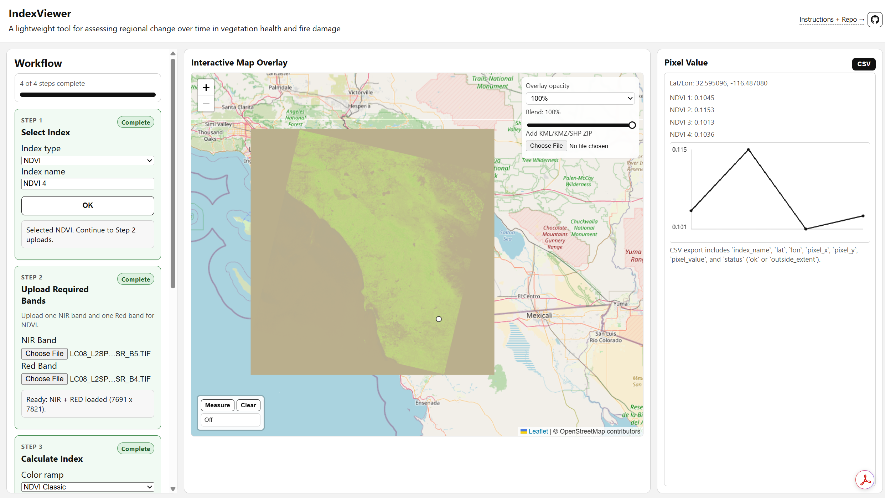

# IndexViewer

A lightweight tool for assessing regional change over time in vegetation health and fire damage 🛰️🌿. https://bmarkman1234.github.io/IndexViewer/

## App Screenshot

## Free Satellite Data Sources

## Workflow Steps

### Step 1: Select Index

1. Open the app in your browser.
2. Choose `NDVI` or `NBR`.
3. (Optional) Enter an index name.
4. Click **OK**.

### Step 2: Upload Required Bands

1. Upload a `NIR` band.
2. Upload the second required band:
   - `Red` for NDVI
   - `SWIR2` for NBR

### Step 3: Create Index

1. Choose a color ramp.
2. Click **Calculate Index And Show On Map**.

Formulas used:
- NDVI: `(NIR - Red) / (NIR + Red)`
- NBR: `(NIR - SWIR2) / (NIR + SWIR2)`

### Step 4: Save And Compare

1. Use the saved index controls to switch between calculated indices.
2. Click **New Index** to start another calculation while keeping previous saved results.

### Step 5: Pixel Value And CSV

1. If the Measure tool is on, click **Measure** to turn it off first.
2. Click the map to sample pixel values for available indices.
3. Export CSV from the Pixel Value panel.

### Measurement Tool

1. Use the **Measure** button in the bottom-left of the map to turn measuring on/off.
2. In measure mode, click map points to create a path and view total distance.
3. Click **Clear** to reset the measured path.
4. Turn measure mode off before selecting pixel values.

### Optional Overlay

1. Upload vector overlays (`.kml`, `.kmz`, `.zip` shapefile) to view reference boundaries.

## CSV Fields

`index_name`, `lat`, `lon`, `pixel_x`, `pixel_y`, `pixel_value`, `status`
